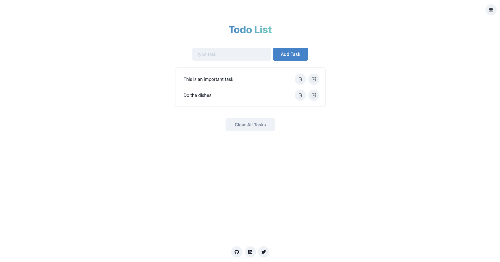

# React todo list
A simple React todo-list using React, Chakra UI, React icons. Tasks are currently stored in localstorage, this is all client. I may use this as a template to add Redis or maybe another small DB service in the near future.



This example has deon some rounds, I dont know who to credit, but I have found example [here](https://github.com/raminhuk/react-todo-list) and [here](https://github.com/erfjs/Todo-list) to one with Supabase [here](https://github.com/voidranjer/supabase-todo)

## 🚀 Getting Started

+ Clone  
```jsx
git clone https://github.com/jrandersen/react-todo-list.git
```
+ Change directory into react-todo-list
```jsx
cd react-todo-list
```
+ Install dependencies from package.json 
```jsx
npm install
```
+ Execute npm start to srat teh server, frontend is on  http://localhost:3000/
```jsx
npm start
```
